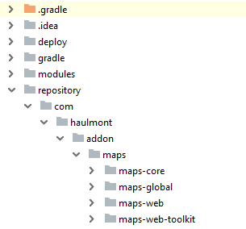
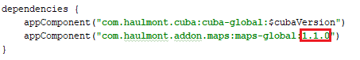
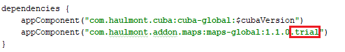

# Maps Demo

This is an example of CUBA application working with the [CUBA Maps premium add-on](https://www.cuba-platform.com/marketplace/maps/). Based on CUBA Platform 7.1.0

## Overview

The application has three entities with corresponding screens:

* `Territory` - defines a territory as a polygon on the map.
* `Salesperson` - a salesperson assigned to a territory.
* `Order` - contains date, amount and the reference to a salesperson.

The editor screens of these entities have a map, where you can modify corresponding geometry.

The *Map* screen displays the map with two vector layers: `territories` and `salespersons`. If you click to a salesperson, a popup window with the salesperson's details will be opened.

The *Canvas* screen demonstrates examples of working with the map's canvas.

The *Orders* screen contains a list of orders. If you click to the *Show map* button, a screen with a map will be opened in a dialog. The map contains a layer of orders with clustering enabled. You can click to the *Generate 100 orders* button in order to automatically generate 100 new orders. The *Orders* screen also has *Show heatmap* button. If you click this button, you will see a heatmap of orders opened in a new screen.

*Note*: the application requires the commercial subscription that includes Maps premium add-on.

## How to Install the Maps Add-on Trial Version

You can get trial subscription from [CUBA Marketplace](https://www.cuba-platform.com/marketplace/maps/) to run this application on your local environment. After getting trial subscription you'll receive an email with a link for downloading ZIP archive with artifacts.

To install the trial version of Maps add-on:
1. Get trial subscription from [CUBA Marketplace](https://www.cuba-platform.com/marketplace/maps/). You'll get an email with a link and instructions.

2. Download ZIP archive with artifacts at link from the email.

3. Go to the user's home directory and create `.m2` folder if it doesn't exist. It is your local Maven repository. Default home directory for operating system:

  * Windows - `C:\Users\<username>`
  * Linux - `/home/<username>`
  * macOS - `/Users/<username>`

4. Create `repository` folder in `.m2`.

5. Unzip the file with artifacts into this directory. You should get the following directory structure:

 
 
6. Clone the repository of this demo project.

7. Open demo project in CUBA Studio.

8. Open `build.gradle` file, find a string with add-on coordinates and replace the add-on version with the latest one. Check the latest version on [CUBA Marketplace](https://www.cuba-platform.com/marketplace/maps/).

 
 
9. Then add `.trial` to the end of add-on coordinates.

 
 
10. Go to *CUBA -> Build Tasks -> Deploy* to check that the add-on was installed successfully.     

## Issues
Please use https://www.cuba-platform.com/discuss for discussion, support, and reporting problems corresponding to this sample.
